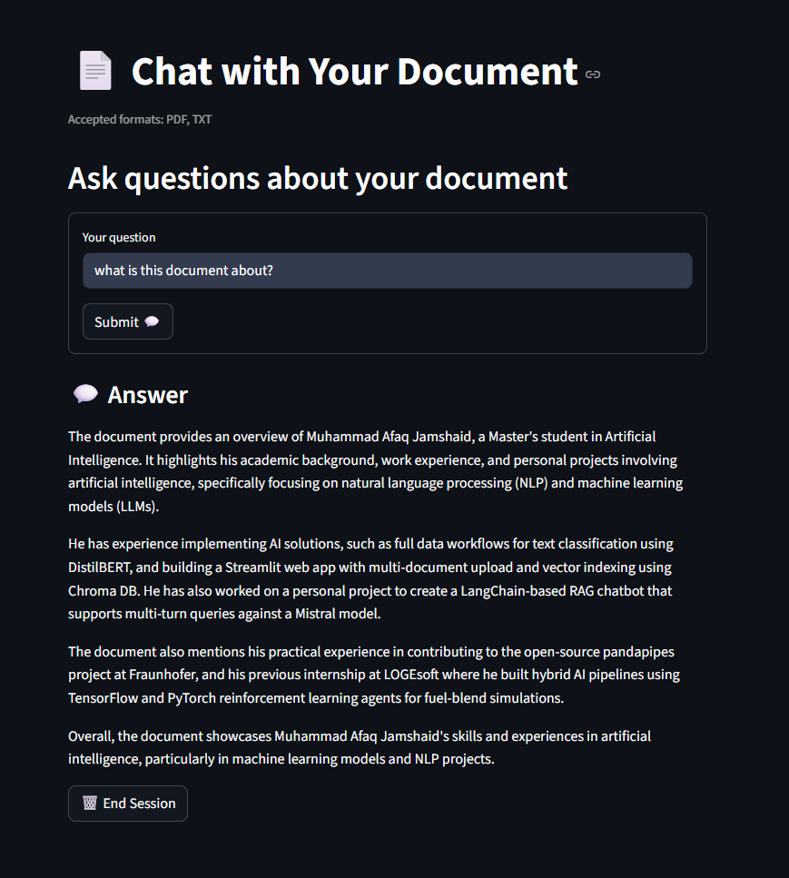

# 📄 ClarityQA — Chat With Your Documents

ClarityQA is a Streamlit application that allows you to upload your PDF or text files and interact with them in natural language. It uses document chunking, vector embeddings, and a local LLM to retrieve and generate precise answers to your questions.


## 🚀 Demo




---

## ✨ Features

- 📤 Upload PDF or TXT documents
- 🧩 Automatic document chunking for efficient retrieval
- 🧠 Embedding & indexing using HuggingFace MiniLM
- 🤖 Local LLM powered by [Ollama](https://ollama.ai) with the Mistral model
- 💬 Ask questions in natural language with contextual answers
- 🗑️ Clear session to remove vectors and reset the system


---

## 🛠️ Installation

### 1. Clone the Repository
```bash
git clone https://github.com/your-username/ClarityQA.git
cd ClarityQA
```

### 2. Create a Virtual Environment
```bash
python -m venv venv
source venv/bin/activate   # On Windows: venv\\Scripts\\activate
```

### 3. Install Dependencies
```bash
pip install -r requirements.txt
```

### 4. Install Ollama (for the LLM)
Follow the installation instructions at [Ollama Docs](https://ollama.ai).

Make sure the `mistral` model is available:
```bash
ollama pull mistral
```

---

## ▶️ Run the App

```bash
streamlit run main.py
```

Then open the URL provided in the terminal (usually http://localhost:8501).

---

## 📂 Project Structure

```
├── main.py                  # Streamlit app
├── requirements.txt         # Python dependencies
├── modules/
│   ├── loader.py            # PDF/TXT loader and splitter
│   ├── vector_store.py      # Embedding & Chroma vector store logic
│   └── llm_chain.py         # LLM chain with prompt
├── temp_docs/               # Temporary uploaded files (auto-created)
├── chroma_db/               # Persistent vector database (auto-created)
```

- **`temp_docs/`** and **`chroma_db/`** are created automatically at runtime.

---

## 🧹 Clearing Memory

Click the **“🗑️ End Session”** button in the app to remove embeddings and reset the app state.  
No need to manually delete folders — the app handles it.

---

## 🤝 Contributing

Pull requests and feature suggestions are welcome!

